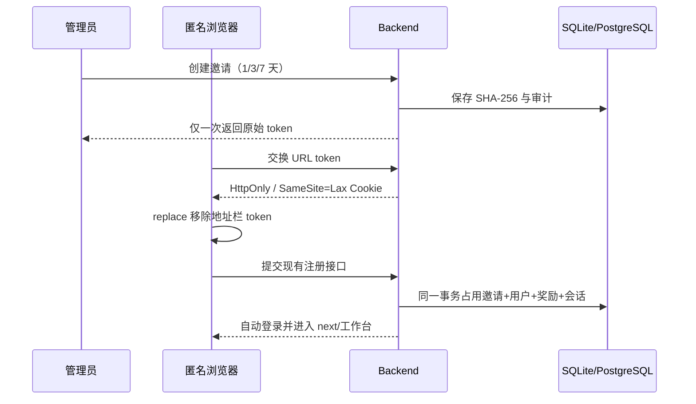

# 用户管理邀请注册验收记录

本项目在不开放全局公开注册的前提下，为管理员提供单次、限时、可撤销的普通用户邀请链接。本文档是实现、验证证据和回滚边界的单一交付索引。

## 安全与数据边界

- 基线为 `873edfcf1c1285279bb27c9d718f68bd27240fbb`，在独立 `feat/user-registration-invites` 分支和独立 worktree 开发。
- 不读写生产数据，不部署、不推送、不发送真实邮件，不调用付费渠道。
- 原始 token 只在创建响应和短期 HttpOnly Cookie 中存在；持久层只保存 SHA-256。
- 邀请分支的角色由后端固定为 `user`，请求体无角色字段。



## 验收范围

| 层      | 验收结果                                                                                                                                           | 尚未执行                                                       |
| ------- | -------------------------------------------------------------------------------------------------------------------------------------------------- | -------------------------------------------------------------- |
| Backend | 权限、状态、哈希、审计、关闭公开注册、并发单次、失败回滚、奖励、Cookie 属性、SQLite Schema 7 和全量 Go 测试均通过                                  | 配置 `CANVAS_TEST_POSTGRES_DSN` 后的 PostgreSQL 升级与事务复验 |
| Web     | 管理入口、链接只显示一次、复制成功/失败、状态/撤销、token replace、注册关闭路由优先级和各错误态合同；1686 项测试、类型检查、生产构建与体积预算通过 | 无                                                             |
| 闭环    | 隔离 SQLite 已完成管理创建 → 匿名交换 → 地址栏清理 → 注册 → 自动登录 → 已使用 → 再访拒绝；已另测过期和撤销                                         | 无                                                             |

## 可复现命令

```bash
cd backend
go test ./internal/database ./internal/service ./internal/handler
go test ./...

cd ../web
bun test test/registration-invites.test.ts test/auth-login-experience.test.ts
bun test
bun run typecheck
bun run build
```

PostgreSQL 仅使用专用测试库：

```bash
cd backend
CANVAS_TEST_POSTGRES_DSN='<isolated-test-dsn>' go test ./internal/database -run Postgres -count=1
```

不得用生产 DSN 替代缺失的隔离 PostgreSQL。

## 浏览器与视觉证据

浏览器验收使用 `CANVAS_REGISTRATION_ENABLED=false`、独立临时数据目录和本地端口，不发送邮件或触发任何付费渠道。结果如下：

- 首位本地管理员创建 7 天邀请；匿名会话交换后地址从 `?invite=...` 立即替换为 `?invited=1`。
- 无邮箱和验证码创建 `user` 角色账号，成功后自动进入创作台；管理员记录显示“已使用”和使用用户名。
- 同一链接的新匿名会话显示“邀请已使用”；另一个链接经管理端撤销后显示“邀请已撤销”；第三个链接在隔离数据库中前移到期时间后显示“邀请已过期”。三种终态地址栏均无 token。
- Clipboard 正常路径显示复制成功；注入拒绝时显示“复制失败，请手动选中链接复制”。Esc 关闭含一次性链接的抽屉时显示确认，Tab 可从关闭按钮进入用户名字段，Enter 触发表单原生校验。
- 1366×768 和 390×844 的亮暗主题截图均无横向溢出；移动端抽屉实测宽度为 390px。受邀注册采用既有深色电影入口视觉，但分别在亮、暗应用主题状态下复验。
- 干净的受邀、已撤销、已过期会话无页面异常，网络记录无 `4xx/5xx`。

本地证据位于 `.local/evidence/registration-invites/`（目录被 Git 忽略，避免把一次性链接截图提交到仓库）。其中包括全量测试日志、构建日志、状态页截图和四组桌面/移动端视觉截图。

## 验证结果

| 验证                          | 结果                                                            |
| ----------------------------- | --------------------------------------------------------------- |
| `go test ./...`               | 通过                                                            |
| `bun test`                    | 1686 通过，0 失败                                               |
| `bun run typecheck`           | 通过                                                            |
| `bun run build`               | 通过，全部体积预算通过                                          |
| 本次 Web 改动文件 Prettier    | 通过                                                            |
| 仓库级 `bun run format:check` | 基线仍有 386 个既有未格式化文件；本功能未扩大该范围             |
| PostgreSQL 专项               | 未执行：环境未配置 `CANVAS_TEST_POSTGRES_DSN`，未用生产数据替代 |

## 回滚边界

提交按依赖顺序组织：已知 Web 格式门禁为独立提交，功能实现和文档/证据各自独立。完成后从最新提交向前逐项执行 `git revert <commit>`；不回退 Schema 7 表或删除已有邀请数据，而是先回退应用读写再另行制定数据保留策略。
